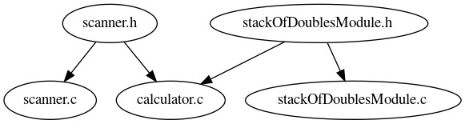
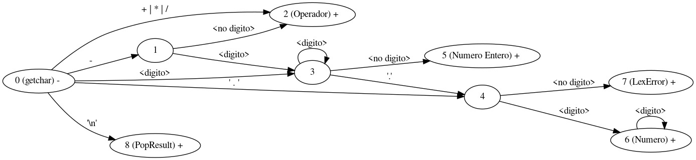
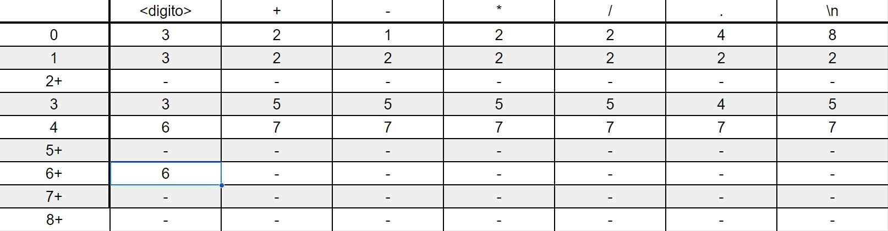

# TP 25: Calculadora con notacion polaca inversa


* Luca Colamonici
* K2051


1. Estudiar la implementación de las sección 4.3 de [KR1988].
2. Construir los siguientes componentes, con las siguientes entidades públicas:
3. Leer Gramáticas y BNF de [MUCH2012].
4. Diseñar una gramática para la calculadora RPN y presentarla en BNF en
Readme.md.
**Respuesta:**
```<digito> ::= 1|2|3|4|5|6|7|8|9|0

<numeroEntero> ::= <digito> | <digito><numeroEntero>

<numero> ::= <numeroEntero> | <numeroEntero>'.'<numeroEntero>
                            |'-'<numeroEntero>
                            |'-'<numeroEntero>'.'<numeroEntero>

<operador> ::= +|-|*|/

<expresion> ::= <numero> | <expresion> <expresion> <operador>
```

1. Diagramar en Dot las dependencias entre los componentes e interfaces.



2. Definir formalmente y con digrafo en Dot la máquina de estados que
implementa GetNextToken, utilizar estados finales para diferentes para cada
clase de tokens.

definición formal: la maquina de estados es la 5-upla (Q, Σ, T, Q0, F) donde:
- Q = {0,1,2,3,4,5,6,7,8}
- Σ es el conjunto de los digitos, los espaciadores, +,-,*,/, '.' y \n
- T se puede representar con la tabla:

- Q0 = 0
- F={2, 5, 6, 7, 8}

3. Escribir un archivo expresiones.txt para probar la calculadora.
4. Construir el programa Calculator.
5. Ejecutar Calculator < expresiones.txt.
6. Responder:
a. ¿Es necesario modificar StackModule.h? ¿Por qué?
**Rta:**
No hace falta modificar stackModule.h ni ningun otro archivo al ejecutar ```calculator < expresiones.txt``` (suponiendo que el programa ya esté compilado y funcional).
Lo unico que cambia al ejecutar el comando es que el programa se ejecuta tomando expresiones.txt como entrada, por lo que el funcionamiento del programa (especificamente el funcionamiento de la pila) no requiere ningun cambio

b. ¿Es necesario recompilar la implementación de Stack? ¿Por qué?
**Rta:**
No es necesario por la misma razón que el punto anterior. Usar expresiones.txt como entrada no supone la necesidad de un cambio en la implementación de la pila ya que: 
- el programa no distingue entre la entrada que genera una persona por teclado y un archivo de texto
- la implementación de la pila nunca interactua con los datos de entrada, recibe los valores numericos ya evaluados por el scanner.

c. ¿Es necesario que Calculator muestre el lexema que originó el error léxico? Justifique su decisión.
**Rta:**
mostrar el lexema que origina un error lexico es necesario para:
- dejar al usuario ver donde está el error
- permitir comprobar que efectivamente se trata de un error lexico y no un mal funcionamiento del programa

i. Si decide hacerlo, ¿de qué forma debería exponerse el lexema?
Algunas opciones:
• Tercer componente lexeme en Token¿De qué tipo de dato es
aplicable?
__Esta es la opción elegida.__ Se puede sumar un tercer componente ```lexeme``` de tipo ```char*``` que se vaya llenando a medida que se leen los caracteres. Luego, con el componente ```type``` (que por restricciones del TP, ya incluye LexError) se puede determinar que lexema/s de una expresion contienen errores lexicos

• Cambiar el tipo de val para que sea un union que pueda
representar el valor para Number y valor LexError.
ii. Implemente la solución según su decisión.
